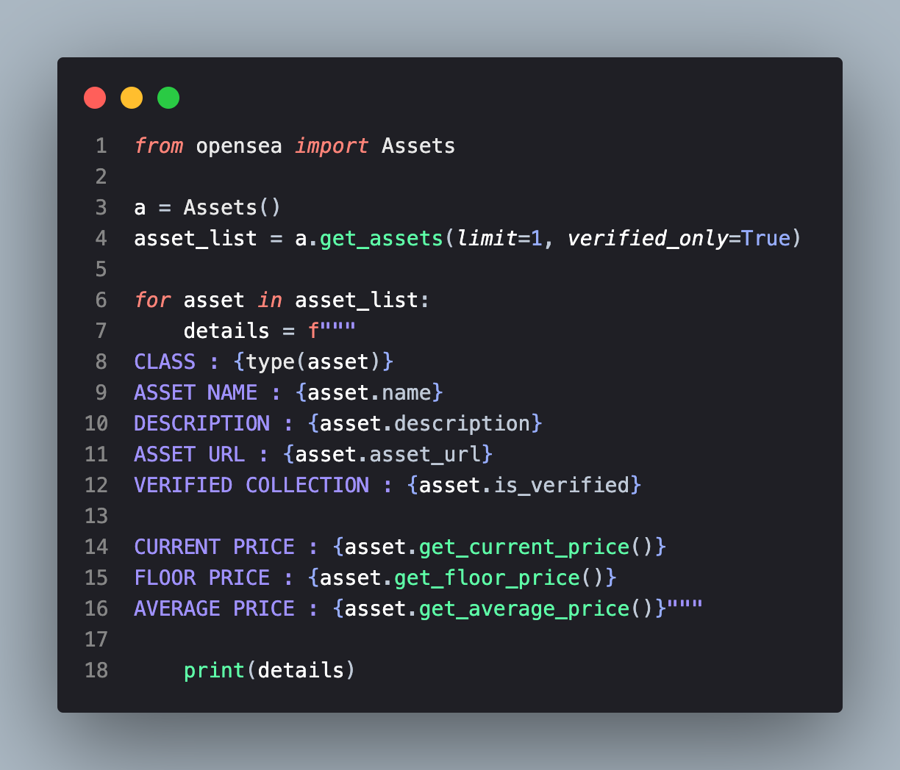
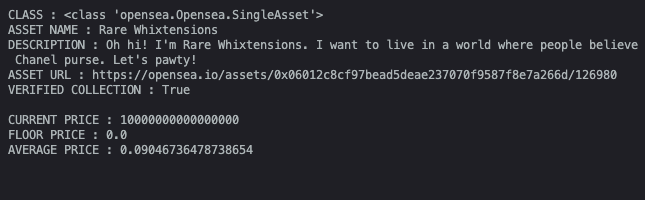

# Opensea API

An API wrapper library for opensea api.

## Installation

```python
pip3 install opensea
```

## Usage

```python
form opensea import Assets
assets = Assets()

# This will return a list of assets which you can iterate and get the needed data
asset_list = assets.get_assets(limit=10,verified_only=False)

asset = asset_list[0] # Get the first asset obejct from the list

print(asset.name)
print(asset.description)
print(asset.asset_url)
print(asset.get_floor_price()) # Floor price of the collection
```

Example\



